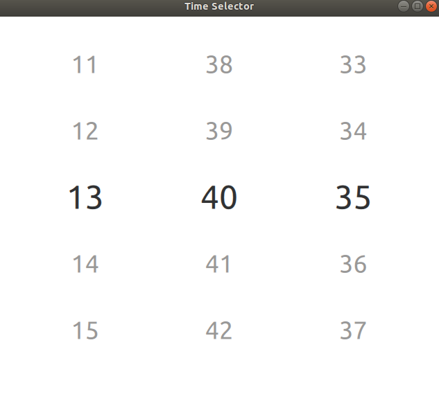
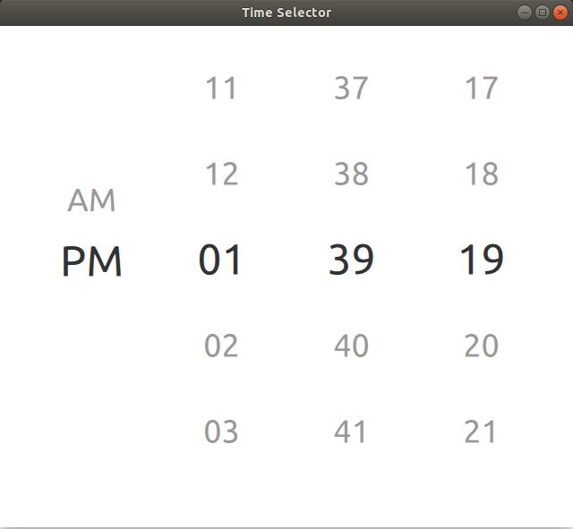
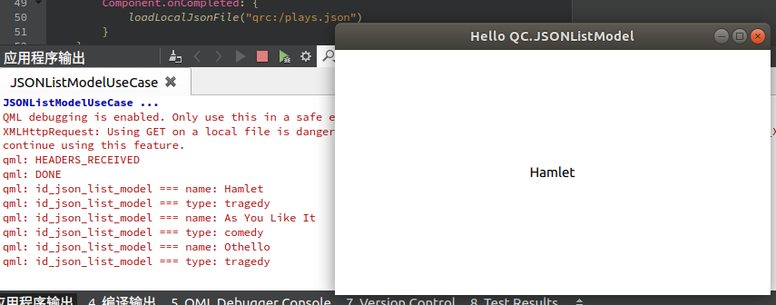

# qml-action

A fully open source QML controls library

- [qml-action](#qml-action)
  - [1. QML Time Selector](#1-qml-time-selector)
  - [2. JSONListModel](#2-jsonlistmodel)

## 1. QML Time Selector

a  simple time selector，you can also change it to a date selector  as you like.

## 2. JSONListModel

a simple model for loading a local JSON file, JSONListModel base on XMLHttpRequest and QML ListModel. See the source code or use case for details.

